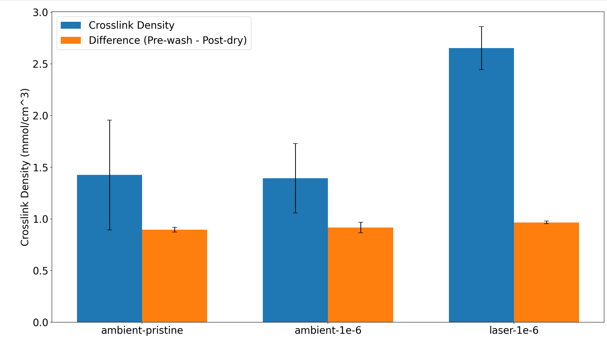
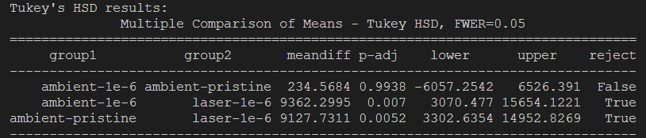

# Soxhlet wash data extraction script

This project uses solvent interaction data to estimate cross-link density and gel fraction of PDMS.  It also determines significant difference through a Tukey HSD test.  It is designed to work with iterated samples and data presented in a custom csv format.

## Output

### Example Crosslink Density + Gel Fraction Output
 "Example Output")

### Example Tukey HSD Test Output (console)

### (rightmost column indicates rejection of the null hypothesis, i.e. significant difference)

## Usage

for use with custom csv format where:
  - row 1 is "sample, pre-wash, wash, post-dry"
  - sample names are formatted as "this_1", "this_2", "that_1", "that_2", etc.
  - mass is in grams

### example:

## Theory

### Flory-Huggins theory

Flory-Huggins theory models the free energy of mixing for a polymer solution (here, PDMS in hexane).  This can be used to estimate the number of polymer chains in a given volume of solvent, n:

$$
n = \frac{ln(1-v) + v+ \chi v^{2}}{V(v^{1/3} - \frac{v}{2})}
$$

where $v$ ($v_{poly}$) is the volume fraction of polymer in the swollen mass, $\chi$ ($\chi_1$) is the system-dependent Flory-Huggins interaction parameter, and $V$ ($V_{mol,solv}$) is the molar volume of the solvent ([Fanse et al., 2022](https://www.ncbi.nlm.nih.gov/pmc/articles/PMC9208241/)).

The value $n$ is useful directly, but it can also be related to the elastic modulus ($E$) of the polymer by the equation:

$$
E = 3 \cdot n \cdot R \cdot T
$$

where $R$ is the gas constant and $T$ is the absolute temperature.

### Gel Fraction

The gel fraction is the amount of polymer that has reached the gel point and is not removed over the course of the solvent wash.  It is derived simply as the mass of the polymer remaining after the removal of unincorporated oligomers as a fraction of original mass, i.e.:

$$
f_{gel} = \frac{m_{postdry}}{m_{prewash}}
$$ 

## To Do:
  - [x] Rework stats for readability and ANOVA testing
  - [x] Add gel fraction to the crosslink density calculation/plot
  - [ ] Consider why the crosslink density results are higher than those found in the Fanse et al. reference