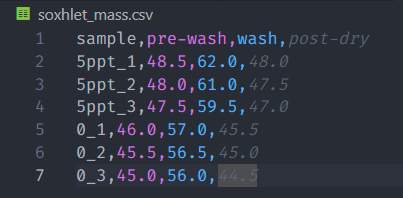
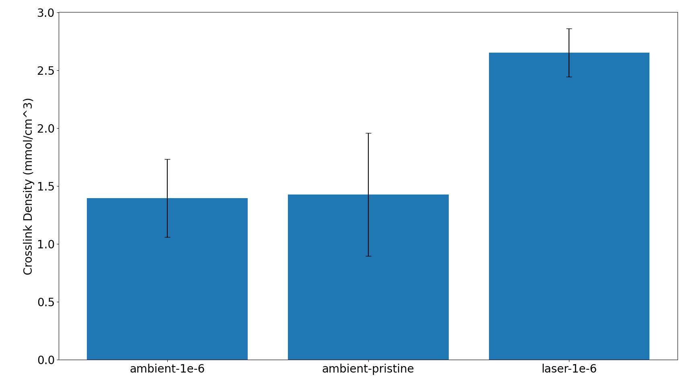

# Soxhlet wash data extraction script

This project uses Flory-Huggins theory to estimate the number of polymer chains in PDMS after a solvent wash. 

 ## Flory-Huggins theory

 Flory-Huggins theory models the free energy of mixing for a polymer solution (here, PDMS in hexane).  This can be used to estimate the number of polymer chains in a given volume of solvent, n:

$$
n = \frac{ln(1-v_{poly}) + v_{poly} + \chi_{1} v^{2}_{poly}}{V_{mol,solv}(v^{1/3}_{poly} - \frac{v_{poly}}{2})}
$$

$$
test1 = \frac{a}{b}
$$

$$
test2.1 = ln(1-v_{poly}) + v_{poly} + \chi_{1} v^{2}_{poly} V_{mol,solv}(v^{1/3}_{poly} - \frac{v_{poly}}{2})
$$

$$
test3 = v_{poly} + \chi_{1}
$$

$$
test2.2 = ln(asdf) + v_{asdf} + V_{mol,solv}(v) - \frac{v_{poly}}{2}
$$

where $v_{poly}$ is the volume fraction of polymer in the swollen mass, $\chi_1$ is the system-dependent Flory-Huggins interaction parameter, and $V_{mol,solv}$ is the molar volume of the solvent.

The value $n$ is useful directly, but it can also be related to the elastic modulus ($E$) of the polymer by the equation:

$$
E = 3 \cdot n \cdot R \cdot T
$$

where $R$ is the gas constant and $T$ is the absolute temperature.

## Usage
for use with custom csv format where:
   - row 1 is "sample, pre-wash, wash, post-dry"
   - sample names are formatted as "this_1", "this_2", "that_1", "that_2", etc.
   - mass is in grams

 
 
 

 ## To Do:
   - [ ] Add support for different solvent and polymer systems
   - [ ] Rework stats workup